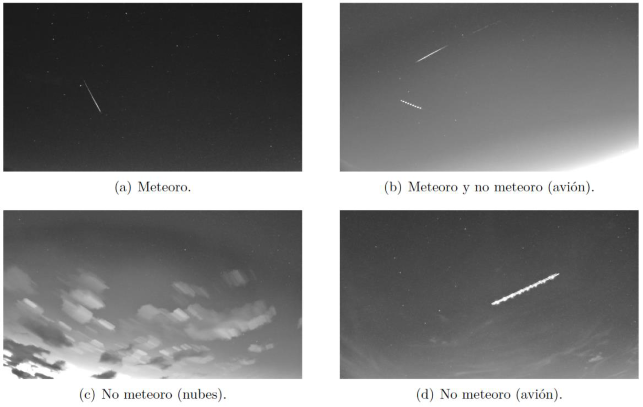

# Objetivos

El proyecto fomentará la participación de la sociedad en iniciativas de ciencia ciudadana con el principal objetivo de **aumentar las vocaciones científicas de los jóvenes**, garantizando la futura competitividad en términos de investigación y desarrollo, mostrándoles el método y la práctica investigadora y haciéndoles partícipes de proyectos de investigación en curso como la detección y clasificación de meteoros. Será una manera además de concienciar a la sociedad sobre la **importancia de la colaboración ciudadana y retirar las barreras que impiden la acción conjunta entre población y científicos.**

Los objetivos técnicos de “Destellos del universo” son: 

1) poner en marcha un conjunto de cámaras allsky que funcionen de forma automática y sincronizada, de modo que se grabe un vídeo cada vez que se detecte un objeto en el cielo; 

2) desarrollar un experimento web con una interfaz muy sencilla que muestre un vídeo y permita a cualquier usuario determinar si es o no un meteoro; 

3) generar un dataset abierto con todos los datos registrados y que estén disponibles para cualquier investigador, amateur y público general.

# Infraestructura

El equipo del proyecto cuenta con varias [estaciones de radiodetección](https://cslab-upm.github.io/sonidosdelcielo/proyecto/), gracias a los proyectos previos Sonidos del Cielo y Contadores de Estrellas, tal y como se puede leer en detalle en sus páginas web. 

Antenas de radiodetección del proyecto

El proyecto también cuenta con cámaras allsky en el observatorio astronómico Francisco Sánchez (en el Campus de Montegacedo, en la azotea de la Escuela Técnica Superior de Ingenieros Informáticos (UPM), en Boadilla del Monte); en el observatorio del Aula de Astronomía de Fuenlabrada (sede del Grupo Docente Kepler); y algunas otras pertenecientes al Instituto de Astrofísica de Canarias quien cede las imágenes para su estudio.

Cámaras allsky del observatorio astronómico Francisco Sánchez

Imagen tomada por una de las allsky del observatorio astronómico Francisco Sánchez

# Ciencia ciudadana

Se necesita la ayuda de los ciudadanos en una tarea muy simple como es la de analizar los diferentes objetos captados por las allsky. Los astrónomos profesionales no pueden dedicar su tiempo a esta labor y actualmente no existe un software libre que permita realizar dicha tarea con el 100% de efectividad. Como se ve en la siguiente figura, las cámaras allsky pueden grabar secuencias de vídeo en la que no haya meteoros, sino que se trate de nubes, aviones u otros objetos que no interesan para nuestro estudio.

“Destellos del universo” desarrollará un experimento muy sencillo integrado en una de las mayores plataformas de proyectos de Ciencia Ciudadana, Zooniverse, para que cualquier ciudadano participe en dicha tarea y el proceso sea rápido y sencillo.

¿Nos ayudas?

Ya está disponible la versión beta del experimento [enlace](https://www.zooniverse.org/projects/cslab-upm/destellos-del-universo).

# Datos abiertos

Como resultado del proyecto se espera generar un conjunto de datos de vídeos de meteoros, clasificados según características generales, lo que aportará un mayor conocimiento de estos objetos a la comunidad científica.

Este proyecto ofrecerá todos los datos obtenidos de forma pública, por medio de algún repositorio digital abierto, que pueda utilizar un investigador, estudiante, persona en general, para cualquier propósito.

# Concienciación

Por último, a través de este proyecto, queremos concienciar a la sociedad de la importancia de tener un cielo de calidad, libre de contaminación atmosférica y lumínica. Estas son algunas de las metas que marca la ONU para mejorar la vida de todos y que van en la Agenda 2030. El proyecto irá en consonancia con estos Objetivos de Desarrollo Sostenibles (ODS).

